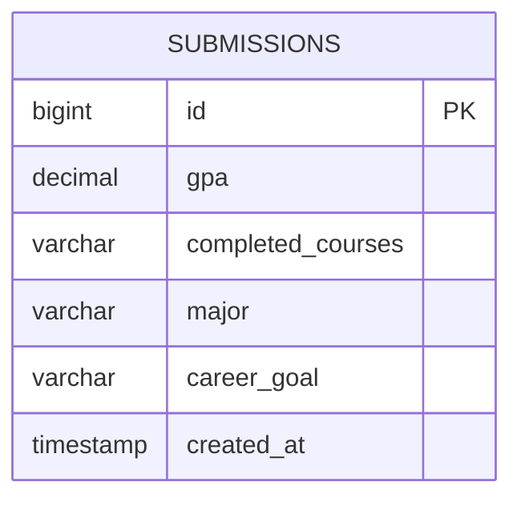

# Database plan (SCRUM-12)

The course recommendation requirements collect GPA, completed courses, major,
and career goal. Store each submission as an anonymous snapshot. No users or
categories table is needed until accounts or managed categories exist; therefore
there are no foreign keys in this first schema. Do not enter real student data
in this unauthenticated classroom demo.

Use file-backed H2 with the existing Java/Spring Boot backend: no database server
is needed. `backend/src/main/resources/schema.sql` creates the table on startup
without deleting existing records.

| Field | Type | Constraint |
| --- | --- | --- |
| id | BIGINT | Generated primary key |
| gpa | NUMERIC(3,2) | Required, 0 through 4 |
| completed_courses | VARCHAR(2000) | Required, nonblank; enter None if empty |
| major | VARCHAR(120) | Required, nonblank |
| career_goal | VARCHAR(200) | Required, nonblank |
| created_at | TIMESTAMP WITH TIME ZONE | Required, database-generated |

Submissions are append-only, so an updated timestamp is unnecessary. Completed
courses are free text for this first collection form, not a course relationship.

