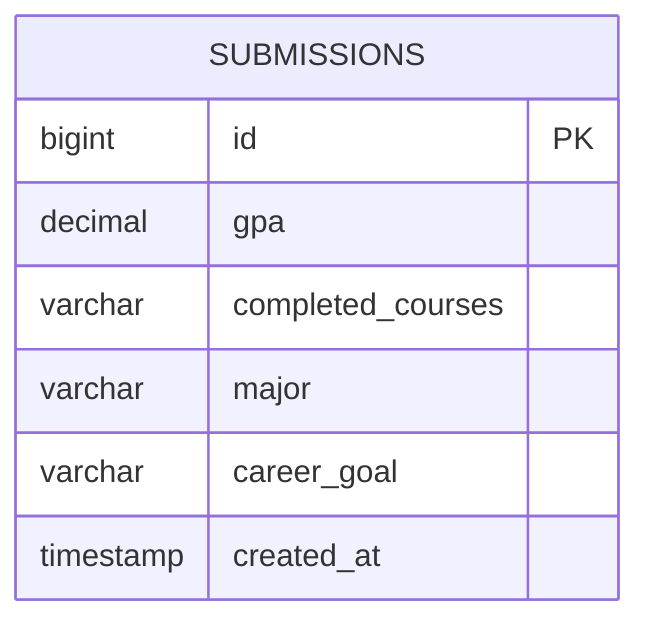

# Database plan (SCRUM-12)

The course recommendation requirements collect GPA, completed courses, major,
and career goal. Store each submission as an anonymous snapshot. No users or
categories table is needed until accounts or managed categories exist; therefore
there are no foreign keys in this first schema. Do not enter real student data
in this unauthenticated classroom demo.

Use file-backed H2 with the existing Java/Spring Boot backend: no database server
is needed. `backend/src/main/resources/schema.sql` creates the table on startup
without deleting existing records.

| Field | Type | Constraint |
| --- | --- | --- |
| id | BIGINT | Generated primary key |
| gpa | NUMERIC(3,2) | Required, 0 through 4 |
| completed_courses | VARCHAR(2000) | Required, nonblank; enter None if empty |
| major | VARCHAR(120) | Required, nonblank |
| career_goal | VARCHAR(200) | Required, nonblank |
| created_at | TIMESTAMP WITH TIME ZONE | Required, database-generated |

Submissions are append-only, so an updated timestamp is unnecessary. Completed
courses are free text for this first collection form, not a course relationship.

## Run locally

From `backend`, export `DB_URL`, `DB_USERNAME`, and `DB_PASSWORD` using the safe
local values in `.env.example`, then run `./mvnw spring-boot:run` (Windows:
`.\mvnw.cmd spring-boot:run`). The same local values are defaults. No `.env`
loader is installed. Keep the database path stable to retain records across
restarts. Java 17+ is required. The API binds to loopback for this demo.

`POST /submissions` accepts JSON such as
`{"gpa":3.4,"completedCourses":"CMPS 1500","major":"Computer Science","careerGoal":"Software engineer"}`.
It returns the saved record with generated ID and timestamp (201). Invalid
input returns 400; database failures return 503 without connection details.
`GET /submissions` returns saved records newest first (200).

From `frontend`, run `npm ci` then `npm run dev` and open
`http://localhost:5173`. The existing course recommendations remain static;
this foundation saves inputs but does not yet personalize recommendations.
Authentication and per-student access are future work before using real data.
