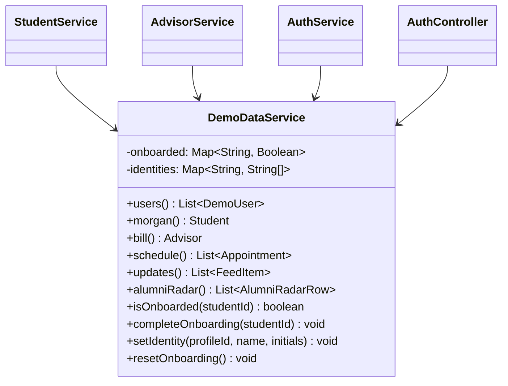
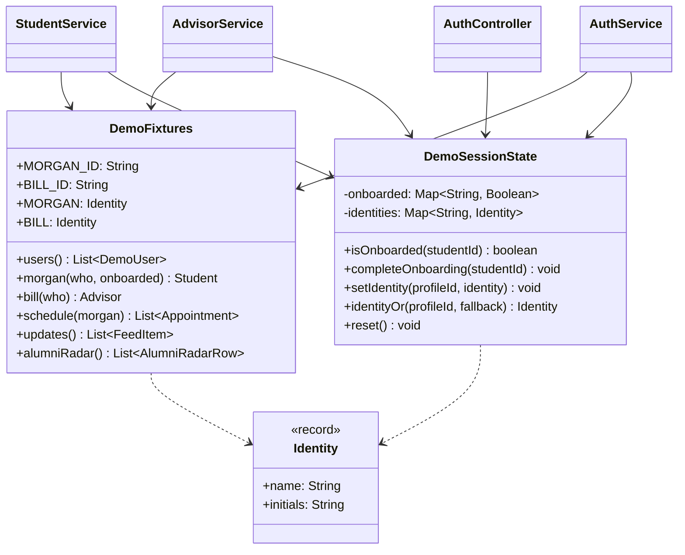

# Refactoring Log

Before/after entries for each refactoring, with the commit that made it.

## 1. Split `DemoDataService` into fixtures and session state

**Principle:** Single Responsibility · **Jira:** SCRUM-59 (SCRUM-61 to SCRUM-64) · **Commit:** [`fec28c0`](https://github.com/WeildTheSword/streetcar/commit/fec28c0)

**Before.** `DemoDataService` held the hardcoded demo fixtures *and* the demo's mutable state (the onboarding flags and the identities that sign-ups wear). Every fixture method read the state maps, so the class had two reasons to change, and all four of its callers depended on both jobs. See [solid-audit.md](solid-audit.md) for why this one was picked.

**After.** `DemoFixtures` is stateless: each method is a pure function of the identity and onboarding flag passed in. `DemoSessionState` owns the two maps. The services read the state, then ask the fixtures for the matching record. `AuthController` only needs the state to reset the demo, so it no longer sees the fixtures at all. The `String[]` identity pair became an `Identity` record.

**Result.** The API responses are unchanged. The fixtures and the state are now tested separately (`DemoFixturesTest`, `DemoSessionStateTest`), and a state test no longer builds the fixture set.
